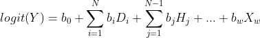

# Tractor without Hail

## Introduction

This script was implemeneted based on the model published in Nature Genetics Atkinson et al (https://www.nature.com/articles/s41588-020-00766-y). In this script we implementented:

- The model is easily aplicable to a N-way admixed population. 

We do this using the equation



Which sum means summation the H_i represents the number haplotypes for the ancestry i (all ancestries except one), the D_j represents the dosage for the ancestry j (All ancestries) and the "... + b_wX_w" means the other covariates  (Thank you Elizabeth Atkinson for the help).
To do this our model uses the files generated by step 1 from the original pipeline (https://github.com/eatkinson/Tractor/wiki/Step-1:-Recovering-tracts-(Optional)) except for bcftools annotate

We create a covariative file for each SNP and run SNP by SNP glmm.wald (slow, we try address this using multiprocessing). To be faster, we do not exclude the temporary files, but the final file will be one with all tested SNPs (<outputPrefix>_AllWald.txt)

- The model uses Generalized linear mixed model (package GMMAT on R) to uses a kinship matrix and the whole data from imputed data

Imputed SNPs between two windows inherit the ancestry of the nearest window


## How to use

Our pipeline uses R with the libraries SeqArray and GMMAT installed, bcftools and python 3.

We recommend the use of kinship matrix (you can convert from PLINK or KING using the scripts present in this GitHub).

Example of command line:

```
python3.8 main.py -c Covar.txt -v /home/USER/TopMed/WithoutHWE/chr22.dose.unkinked_Covar_MAF.vcf.gz -n 3 -m /home/USER/TopMed/WithoutHWE/Tractor/RFMixV1_chr22_AllSets.Unkinked.msp.tsv -i ID -p DISEASE -o /home/USER/TopMed/WithoutHWE/Tractor/newModel/Teste/Try3 -t 48 -k PLINK_LARGE.table
```

```
Tractor without Hail

optional arguments:
  -h, --help            show this help message and exit

Required arguments:
  -m MSP, --msp MSP     MSP file from RFMix (preferred the unkinked)
  -v VCF, --vcf VCF     VCF file (preferred the unkinked)
  -n NUMANCESTRY, --numAncestry NUMANCESTRY
                        Number of ancestries in MSP file
  -c COVAR, --covar COVAR
                        Table with the covariatives
  -i ID, --id ID        Name of the column with individual ID on covar file
  -p PHENOTYPE, --phenotype PHENOTYPE
                        Name of the column with phenotype
  -o OUTPUT, --output OUTPUT
                        Output file name

Optional arguments:
  -k KINSHIP, --kinship KINSHIP
                        File with kinship coefficient
  -s STATISTICALMODEL, --statisticalModel STATISTICALMODEL
                        Statistical Model. If not provided, we will include any covariatives
  -t THREADS, --threads THREADS
                        Number of threads to run (default = 1)
  -b BCFTOOLS, --bcftools BCFTOOLS
                        Path for the BCFTOOLS (default bcftools)
  -R RSCRIPT, --Rscript RSCRIPT
                        Path for the Rscript with SeqArray and GMMAT installed (default Rscript)
```

Author: Thiago Peixoto Leal, PhD (thpeixotol@hotmail.com)

Contributors: Misterious Posdoc from NIH, PhD
